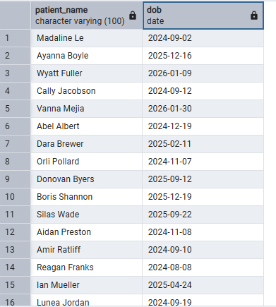
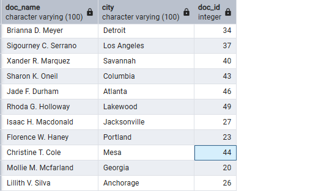
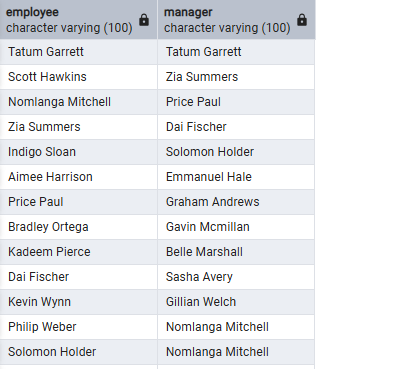
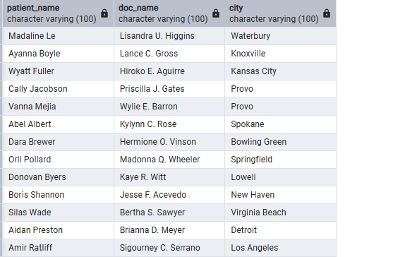
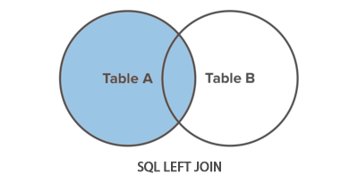
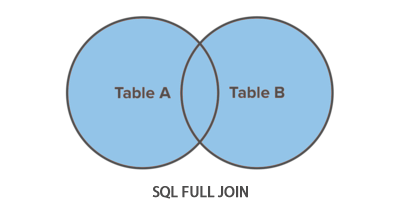
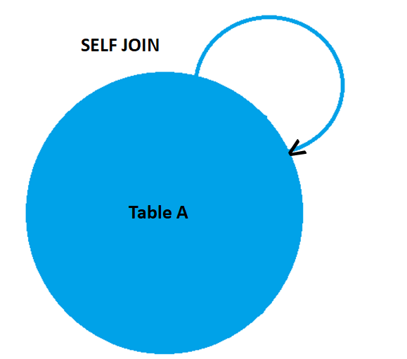

# SQL Joins

---

## SQL Joins Overview

**What are SQL Joins?**
- Operations that combine rows from two or more tables
- Based on related columns between tables
- Essential for retrieving data from normalized databases

---

## Table Aliases


- SQL aliases are used to give a table, or a column in a table, a temporary name.

- Aliases are often used to make column names more readable.

- An alias only exists for the duration of that query.

- An alias is created with the AS keyword.

**Syntax:**
```sql
SELECT doc_name AS doctor_name 
FROM doctors;
```

We can also skip the AS keyword and get the same result:

```sql
SELECT doc_name doctor_name FROM doctors
```


---

## Sample Data

**DOCTORS**


**PATIENTS**


**APPOINTMENTS**


---

## INNER JOIN

**Returns:** Only matching rows from both tables

```sql
SELECT patient_name, dob
FROM patients
INNER JOIN doctors on patients.doctor_id = doctors.id;
```

**Result:**


*This shows patients that have doctors assigned to them.*


INNER is the default join type for JOIN, so when you write JOIN the parser actually writes INNER JOIN.

---

## LEFT JOIN

**Returns:** All rows from left table + matching rows from right

```sql
SELECT patient_name, dob, patients.id as p_id
FROM patients
LEFT JOIN doctors on patients.doctor_id = doctors.id;
```

**Result:**


*All doctors included, even without assigned patients*
---

## SELF JOIN

**Purpose:** Table joins with itself (hierarchical data)

```sql
SELECT e.employee_name AS employee,
       m.employee_name AS manager
FROM employees AS e
LEFT JOIN employees AS m ON e.manager_id = m.id;
```

**Sample EMPLOYEES data:**


**Common Uses:**
- Employee-manager relationships
- Doctor referral chains
- Patient family relationships

---

## FULL OUTER JOIN

**Returns:** All rows from both tables

```sql
SELECT p.patient_name, d.doc_name, d.city
FROM patients AS p
FULL OUTER JOIN doctors AS d ON p.doctor_id = d.id;
```

**Result:**


*Everything from both tables - includes doctors with no patients*

---

## Visual Comparison

**INNER JOIN:** (Only overlap)


**LEFT JOIN:** ●◐ (All left + overlap)  


**FULL OUTER JOIN:** ●○ (Everything)


**SELF JOIN:** ●⟲ (Table to itself)


---

## Best Practices

**Do:**
- Use table aliases consistently
- Index JOIN columns
- Choose appropriate JOIN type
- Filter data early with WHERE

**Avoid:**
- Missing JOIN conditions
- Wrong JOIN type for requirements
- Ignoring NULL handling
- Poor column indexing

---

## Real-World Applications

**INNER JOIN:** Active relationships only
- Patients with assigned doctors
- Appointments with valid patient-doctor pairs

**LEFT JOIN:** Include all from primary table
- All patients (with/without doctors)
- All appointments (even with missing data)

**SELF JOIN:** Hierarchical data
- Employee management structure
- Doctor referral networks
- Patient family relationships

**FULL OUTER JOIN:** Data reconciliation
- Patient-doctor assignment audits
- System data comparisons
- Complete database reviews

---

## Key Takeaways

- **Table aliases** improve readability
- **INNER JOIN** = matches only
- **LEFT JOIN** = all from left + matches
- **SELF JOIN** = table references itself  
- **FULL OUTER JOIN** = everything from both

**Happy Coding Champ!**